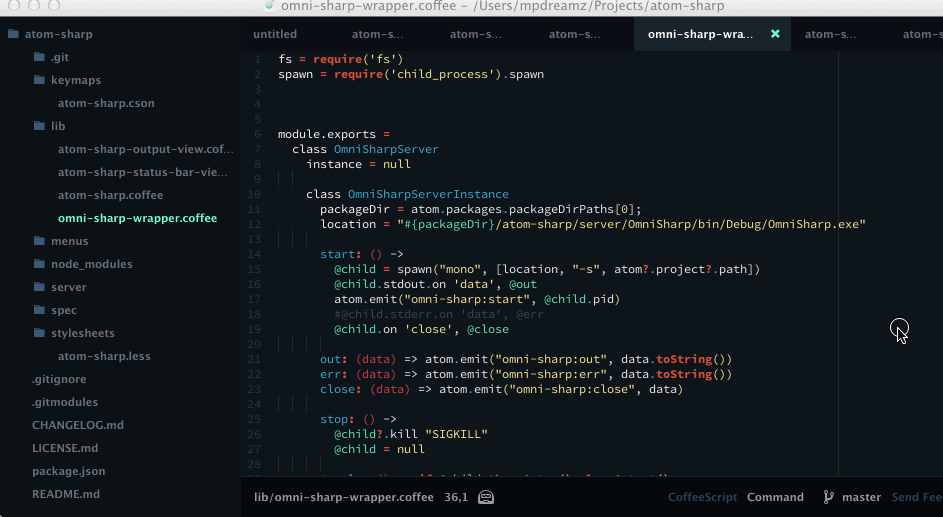

# atom-sharper package
###(The hackable IDE)



## Installation

Right now, there isn't an official Atom package so you'll need to do the following :-

Install npm if you don't have it already.
```
cd ~/.atom/packages # or cd %HOMEPATH%\.atom\packages for Windows
git clone https://github.com/Mpdreamz/atom-sharper.git
./build.sh or ./build.bat (on Windows this assumes that you have msbuild in your PATH)
```

Install the autocomplete-plus-async package using the Atom package manager

## To use

- Open the root of your solution within Atom
- Press Ctrl-Alt-o - this starts the OmniSharp server
- Enjoy!

Completions appear as you type. To select an item, press the TAB key.
